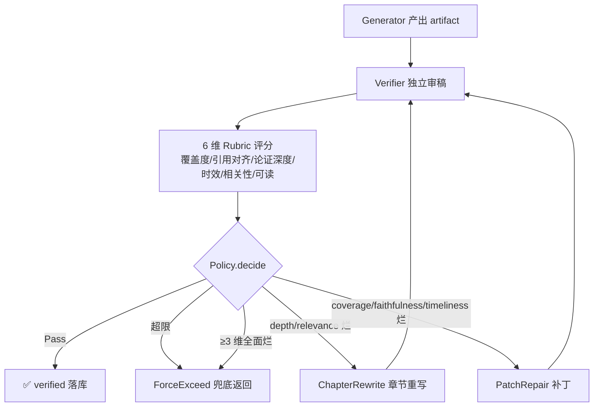

# Verifier Loop · Agent 自闭环质量保障 — 设计与面试

> 一份 Agent 产出靠不靠谱,不能由它自己说了算。Verifier Loop 给每份产出再加一道独立审稿——按 6 维 Rubric 评分,不达标自动选 Patch 或章节重写回炉,直到达标或超限。
> 对应能力域:**Agent 核心**(质量保障层)。代码:`core/agent/loop/`(controller/verifier/rubric/repair/policy/store/models)。

---

## 0. 能力定位(对应招聘要求)

- 对应 JD:**「Agent 工程化」「LLM-as-judge」「Loop Engineering」「Agent 自闭环」「质量评测」**。
- 角色:V0.0.5 主线第二大需求——把 Agent 从「跑得动」推到「跑得准」。是深度研究 / 定时任务的质量底座,也是把离线评测体系(① + ①.5)接进生产的桥梁。

---

## 1. 解决什么问题

- **痛点 1**:V0.0.5 之前 Agent 长任务链路(深度研究 v2 / 定时任务)**没人检查产出**——模型自己宣告完工,引用错位、章节遗漏、时效失真都没有兜底机制。
- **痛点 2**:① 离线评测发现的问题没接进生产。评测是「问题诊断器」,但发现问题后产线没有「修复机制」。
- **痛点 3**:写一份审稿代码,得能覆盖深度研究 + 定时任务 + 评测 A/B 三个场景——不能每个场景重写一次。
- **方案**:落地 **Loop Engineering**(2026.6 Anthropic 提出的范式)——把 Agent 从「LLM 自循环」升级为「**外部系统驱动的循环 + 独立验证 + 智能修复 + 状态持久化**」。

---

## 2. 三个解耦(范式核心)

| 解耦原则 | 在 Comet 的实现 |
|---------|----------------|
| **Verify ⊥ Generate** | Verifier 独立 LLM session,不带 generator 上下文;支持跨 family 模型(SameModelVerifier 同模型基线 / CrossModelVerifier 跨家族 + 工厂自动降级)。 |
| **Controller ⊥ Task** | `LoopController` 通用状态机,深度研究 + 定时任务 + HotpotQA A/B 共用同一实例,wire-up 只多一行。 |
| **State ⊥ Process** | 状态全在 DB(`loop_runs` + `loop_iterations` 两张表),worker 重启可恢复,有完整 audit trail。 |

---

## 3. 架构 / 数据流



---

## 4. 核心设计与实现

### 4.1 6 维 Rubric(直接对齐 ① RAGAS)

| 维度 | 权重 | 评 0~5 | 单维硬门槛 | 对应离线指标 |
|------|-----|-------|-----------|------------|
| 覆盖度 coverage | 0.20 | 子问题覆盖完整度 | ≥3 | RAGAS context_recall |
| 引用对齐 faithfulness | 0.25 | 论断与 [来源N] 匹配 | ≥3 | RAGAS faithfulness ⭐ |
| 论证深度 depth | 0.15 | 论证而非罗列 | ≥2 | (人工质量) |
| 时效性 timeliness | 0.15 | 关键事实是否最新 | ≥3 | 时间窗校验 |
| 相关性 relevance | 0.15 | 切题不跑偏 | ≥3 | RAGAS answer_relevancy |
| 可读 readability | 0.10 | 结构与表达 | ≥2 | (人工质量) |

加权总分 ≥ 0.75 + 全部维度过硬门槛 = 通过。

**深度点**:Rubric 字段定义 / prompt / 评分维度直接复用 V0.0.5 ① 的指标定义,做到「**评测-生产一致性**」——离线发现的弱项就是生产防的弱项,这是面试最值钱的工程证据。

### 4.2 双 Verifier 实现

| 实现 | 用途 | 配置 |
|------|------|------|
| `SameModelVerifier` | 基线 / 默认 | 同 chat 模型重新起一个 messages 数组(不带 generator 历史),用 `critic_role.jinja2` 强调独立审稿人立场 |
| `CrossModelVerifier` | 生产推荐 | `model_configs.type='verifier'` 配跨 family 模型(如 generator 用 DeepSeek、verifier 用 GLM),走 chat/completions 端点 |

**工厂降级**:`build_verifier(kind='cross')` 找不到 verifier 模型时自动降级到 same 并 warning,可用性优先。

**为什么不用同模型 self-critique**:HotpotQA A/B 实验(20 题/组)真实数据——
- same 自评:judge 通过率 0% / EM 一致率 40%
- cross(deepseek + glm-4-flash):judge 通过率 95% / EM 一致率 65%

**结论:self-critique 不可用**,跨家族独立审稿才是数据驱动的工程必选。

### 4.3 智能 Repair 策略(Policy 决策树)

不是「不通过就重做」,而是按问题类型自动选最经济的修复:

```python
# 优先级从高到低
Pass                                  # 总分 ≥ 0.75 + 全部硬门槛过
ForceExceed                           # 超过 max_iterations 或 ≥3 维全面烂
ChapterRewrite                        # depth / relevance 落地 → 章节重写
PatchRepair                           # coverage / faithfulness / timeliness 落地 → 补丁
PatchRepair (兜底)                    # 其他情况
```

| 策略 | 实现 | 何时用 |
|------|------|------|
| `PatchRepair` | 贪心补丁——从 `feedback.missing_coverage` / `wrong_citations` / `issues` 抽子查询(去重截断到 3 条),通过 `ctx["patch_callback"]` 解耦于 research engine,engine 用 reflector 风格补搜+提炼,产出「补充信息(质量复核反馈后追加)」章节追加到 artifact | coverage / faithfulness / timeliness 不达标 |
| `ChapterRewrite` | 章节重写——与 `artifact.headings` **求交集防 verifier 编造章节名**,最多 2 章/轮,通过 `ctx["rewrite_callback"]` 解耦,engine 调 `write_section_stream` 重写并替换 | depth / relevance 不达标 |
| `ForceExceed` | 沿用最后一次 artifact 兜底返回,标记 `failed` 但业务不阻断 | 超限或全面烂 |

**深度点**:不同问题类型走不同修复路径,**默认 max_iterations=2,N 轮内大部分问题能在 Patch 阶段补完**——工程取舍,不是「一刀切重做」。

### 4.4 状态外置(`loop_runs` + `loop_iterations`)

两张表(Alembic 迁移 `7a3c4d5e6f01`):

- `loop_runs(id, task_type, task_id, status, final_score, total_iterations, verifier_kind, started_at, ended_at)`
- `loop_iterations(id, run_id, iteration, scores JSONB, feedback JSONB, decision, repair_action, artifact_snapshot JSONB)`

**每轮 verify 完立即写 `loop_iterations`**,artifact 摘要 JSONB 落库。worker 挂掉重启可从 checkpoint 接着跑,有完整 audit trail。

### 4.5 通用 LoopController(抽象成立的证据)

```python
class LoopController:
    async def run(self, *, task_type, task_id, max_iterations, ctx):
        # 1. generator 产出初版 artifact
        # 2. verifier 评分 + 工厂降级
        # 3. policy.decide → Pass / Exceed / Patch / Rewrite
        # 4. 走 repair_callback → 回到 2
        # 5. 落库 + IterationOutcome.id 预生成 UUID(与 trace span iteration_id 共用)
```

接入点 wire-up **只多一行**:
- 深度研究:`engine.py` 末尾 7 步汇总后接 `LoopController.run(task_type='research')`
- 定时任务:`tasks/agent_task.py` 通过 `_check_loop_passed(report_id)` 反查 LoopRun,不合格不推送
- 离线 A/B:HotpotQA runner 加 `--verifier {none,same,cross}` 接 qa_verifier

**核心代码只多一行 wire-up,直接证明 LoopController 抽象成立**。

---

## 5. 可观测性(Loop 健康度卡)

`DashboardService.loop_health(days=30)` 聚合 `loop_runs` + `loop_iterations.scores.raw` 扫单维不达硬门槛次数,前端 `LoopHealthCard`:
- 4 宫 KPI:总运行数 / 一次通过率 / 平均迭代次数 / 平均评分
- 状态分布进度条(Pass / Exceeded / Failed)
- 失败维度归因 Top(哪一维最容易翻车)
- verifier_kinds 分布(same / cross 比例)

HomePage 在 Agent 简报后渲染(无数据时不显示)。

每条 run 在前端有三档徽章:✅ verified · 0.85 / ⚠ 复核未达标 · 0.55 / 🔄 复核中。

---

## 6. 设计取舍

| 取舍 | 选择 | 原因 |
|------|-----|------|
| 用 LangChain Evaluators? | 不用 | 字段太重、与项目 Rubric 不齐;自己实现 Rubric + LLM-as-judge 更轻 |
| 同模型 vs 跨家族? | 默认 same / 推荐 cross | A/B 数据证明 cross 显著 |
| 普通对话过 verifier? | 不过 | token 翻倍但用户感知不到,负收益 |
| 失败硬阻断? | 不阻断 | 沿用最后一次 artifact 兜底,业务零阻断,失败信息走通知 |
| 每个产出都重做? | 不重做 | 智能 Repair 决策树按问题类型选 Patch / Rewrite / Exceed |

---

## 7. 易踩坑

- **Verifier 编造章节名**:让 verifier 指 weak_chapters 时,大模型偶尔编造 artifact 里没有的章节名。修法:`ChapterRewrite` 与 `artifact.headings` **求交集**,只重写真实存在的。
- **iteration_id 关联**:`IterationOutcome.id` 必须**预生成 UUID** 与 `LoopStore.record_iteration` 共用,这样 ③ Tracing 的 span iteration_id 才能精确绑定到对应迭代轮次。后改困难,设计时就要确定。
- **生成器上下文污染 verifier**:Verifier 必须新开 messages 数组,不能 append 到 generator 的 messages 后面——否则 verifier 倾向于「认同自己刚写的」。
- **失败硬阻断**:任何阶段异常 → 沿用最后一次 artifact 兜底返回,业务零阻断。verifier 模型挂了不能影响主流程。
- **Cross verifier 未配自动降级**:用户没配 verifier 模型时不报错,降级到 same 并打 warning,可用性优先。

---

## 8. 面试讲点(每条对应真决策 + 真数据)

1. **解耦 Verify 与 Generate**:VerifierA(same) vs VerifierB(cross)真实数据对照——HotpotQA 20 题 same judge 通过率 0% / cross 95%,数据说话「为什么不能 self-critique」。
2. **解耦 Controller 与 Task**:深度研究 + 定时任务 + 离线 A/B 三个场景共用同一抽象,只有 wire-up 改一行。
3. **状态外置**:`loop_runs` + `loop_iterations` 两表,worker 重启可恢复,可中断恢复就是工程深度。
4. **智能 Repair 决策树**:不是「不通过就重做」,是按问题类型选 Patch / Rewrite / Exceed,工程取舍。
5. **Rubric 评测-生产一致性**:6 维 Rubric 直接对齐 ① RAGAS 的 faithfulness / context_recall / answer_relevancy,「离线发现的弱项就是生产防的弱项」。
6. **跨模型对照实验**:不是直觉拍脑袋选 verifier,数据驱动选 cross。
7. **明确边界**:不做普通对话 verifier、不做实时流式 verifier、不做用户配 Rubric——知道哪些不该做。

---

## 9. 简历话术(可直接用)

> **Verifier Loop 自闭环质量保障**:实现 Generate→Verify→Repair 三段式 Loop——独立 Verifier(跨家族 LLM-as-judge)按 6 维 Rubric 评分,智能 Repair 策略(Patch/章节重写)按问题类型自动选,Controller 状态外置 DB 可中断恢复;深度研究和定时任务共用同一抽象框架。在 HotpotQA distractor A/B 实验中证明**跨家族审稿通过率 95% 显著高于同模型自评 0%**,数据驱动「不能让模型自评」的工程取舍。架构契合 2026 业界提出的 Loop Engineering 范式(Verify⊥Generate / Controller⊥Task / State⊥Process)。

---

## 10. 相关文件速查

| 类别 | 路径 |
|------|------|
| Controller | `api/app/core/agent/loop/controller.py` |
| Verifier | `api/app/core/agent/loop/verifier/{same,cross}.py` + `build_verifier` 工厂 |
| Rubric | `api/app/core/agent/loop/rubric/__init__.py`(RUBRICS dict) |
| Repair | `api/app/core/agent/loop/repair/{patch,chapter_rewrite}.py` |
| Policy | `api/app/core/agent/loop/policy/__init__.py`(决策树) |
| Store | `api/app/core/agent/loop/store/__init__.py`(`LoopStore`) |
| 模型 | `api/app/core/agent/loop/models.py`(`LoopRun` + `LoopIteration`) + `models/loop_model.py` |
| 迁移 | `api/migrations/versions/7a3c4d5e6f01_*.py` |
| Prompt | `api/app/core/agent/loop/prompts/{critic_role,verify_research}.jinja2` |
| 接入点 | `core/agent/research/engine.py` 末尾 + `tasks/agent_task.py:_check_loop_passed` |
| 仪表盘 | `DashboardService.loop_health` + `web/src/components/dashboard/LoopHealthCard.tsx` |
| HotpotQA A/B | `api/eval/benchmarks/hotpotqa/qa_verifier.py` + `runner.py --verifier {none,same,cross}` |
