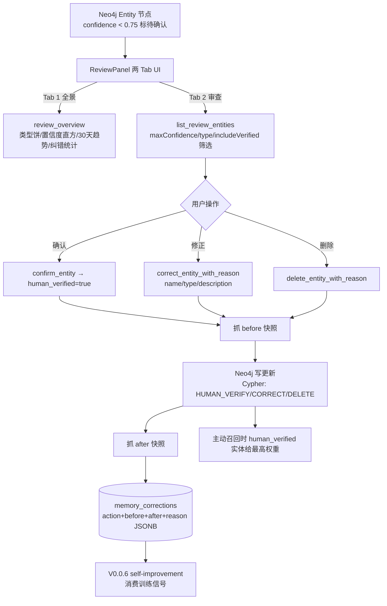

# 记忆审查与人类反馈闭环(Human-in-the-Loop)— 设计与面试

> 让用户全景看 AI 关于自己记住了什么,并能审查、确认、修正、删除低置信度记忆;用户操作沉淀到 `memory_corrections` 数据池,作为下一阶段 self-improvement loop 的训练信号。
> 对应能力域:**记忆系统**(反馈闭环)。代码:`memory_correction_repository.py` / `memory_service.review_*` / `web/src/components/memory/ReviewPanel.tsx`。

---

## 0. 能力定位(对应招聘要求)

- 对应 JD:**「Human-in-the-Loop」「数据飞轮」「人类反馈数据池」「记忆质量保障」**。
- 角色:V0.0.5 主线第四大需求——把跨任务的「人类反馈」接入口打通,让 V0.0.5 的进化闭环接入「人类反馈这一公里」,主题叙事才完整。

---

## 1. 解决什么问题

V0.0.5 之前 Comet 的「记忆系统」(Neo4j 四层溯源图谱 + 三元组萃取 + 两层去重)已有 `confidence` 置信度字段(PR #56 合入),但用户**没路径告诉系统「这条记得错了」**:

- 把「我妹妹林晓」萃成两个独立实体「林晓」「妹妹」
- 把过期信息当现状(用户搬家了,但旧地址实体没下架)
- 把单次玩笑话当稳定偏好

V0.0.5 主题是「自我量化 + 自我审视 + 自我修正 + 人类反馈」。② Verifier Loop 解决了「**任务内自修正**」,⑤ 补上**跨任务的人类反馈**——Human-in-the-Loop。

---

## 2. 设计目标

让用户能:
1. **全景**看到「AI 关于我记住了什么」:实体/关系/事件按类型分布、置信度分布、近期趋势、纠错历史
2. **审查 + 纠错**低置信度实体(确认 / 修正 / 删除三类操作)
3. 所有操作沉淀到 `memory_corrections` 表,作为 **V0.0.6 self-improvement loop 的训练信号源**

明确不做(V0.0.5 范围):
- ❌ 自动消费 corrections 反馈训练(V0.0.6 的事)
- ❌ 让管理员审查全平台数据(个人项目无此需求)
- ❌ 暴露技术指标到 UI(对普通用户违和)

---

## 3. 架构 / 数据流



---

## 4. 数据模型(关键新表)

```sql
memory_corrections(
  id UUID PK,
  user_id FK,
  entity_id,                    -- Neo4j Entity.id
  action ['confirm'|'correct'|'delete'],
  before JSONB,                 -- 操作前实体快照(name/type/description/confidence/aliases)
  after JSONB,                  -- 操作后实体快照(delete 时为 null)
  reason TEXT NULL,             -- 用户填写的原因(可空)
  created_at TIMESTAMPTZ
)
```

Alembic 迁移 `b8d195cf3e7a` 已 upgrade,`models/__init__.py` 注册 `MemoryCorrection`。

Neo4j Entity 节点加 `human_verified` 动态属性(无 schema 变更),`ENTITY_LIST_ALL` Cypher 加返回这个字段。

**为什么留这张表而不直接改 Entity 属性**:既保留**操作历史**(可审计、可回滚)又有**结构化反馈数据**(给 V0.0.6 LLM 总结消费)。如果只改 Entity 属性,纠错过程信息(用户填的 reason、before 快照)就丢了。

---

## 5. 后端实现

### 5.1 Repository 层

`memory_graph_repository.py` 加三个方法:
- `entity_snapshot(entity_id)` —— 抓实体当前完整快照
- `human_verify_entity(entity_id)` —— Cypher 改 `human_verified=true`
- `correct_entity(entity_id, name=?, type=?, description=?)` —— 部分字段更新

`memory_correction_repository.py`:
- `record(action, entity_id, before, after, reason)` —— 落 PG
- `list_recent(user_id, limit)` —— 查最近纠错历史
- `count_by_action(user_id, days)` —— 统计纠错动作分布

### 5.2 Service 层 `memory_service`

| 方法 | 用途 |
|------|------|
| `review_overview(user_id, days=30)` | **全景统计**:实体总数 / 已确认 / 待确认 / 长期 + 类型饼图分布 + 置信度直方 5 桶(0-20/20-40/40-60/60-80/80-100)+ 30 天新增趋势 + 纠错动作计数;`_serializable` 兜底 |
| `list_review_entities(user_id, max_confidence, type, include_verified, limit)` | 审查列表,默认按 confidence 升序、过滤已确认 |
| `confirm_entity(user_id, entity_id)` | 1. 抓 before → 2. Cypher human_verified=true → 3. 抓 after → 4. 落 memory_corrections |
| `correct_entity_with_reason(user_id, entity_id, name/type/desc, reason)` | 同上四步,after 反映修改后字段 |
| `delete_entity_with_reason(user_id, entity_id, reason)` | 同上,after=null |

**核心模式**:每次写操作都是「**before 快照 → 写 Neo4j → after 快照 → 落 PG**」四步,保证可审计、可回滚。

### 5.3 Controller(5 端点)

| 方法 | 路径 | 用途 |
|-----|------|------|
| GET | `/memories/review/overview?days=30` | Tab 1 全景数据 |
| GET | `/memories/review/entities?maxConfidence&type&includeVerified` | Tab 2 列表 |
| POST | `/memories/review/entity/{id}/confirm` | 确认 |
| PATCH | `/memories/review/entity/{id}/correct` | 修正(body 含 name/type/description/reason) |
| DELETE | `/memories/review/entity/{id}` | 删除(body 可带 reason) |

---

## 6. 前端 UI(`ReviewPanel.tsx`)

挂在 `MemoryPage` 第 5 个 Tab,顶部 Segmented 切两 Tab:

### 6.1 Tab 1 · 📊 我的记忆全景

- **4 宫 KPI 卡**:已记住实体 / 长期记住 / 你已确认 / 待你确认(后者可点击直接跳 Tab 2 + 自动应用筛选)
- **三张 ECharts**:
  - 类型饼图(图内 emphasis 标签 + 滚动图例)
  - 置信度直方(按区间红橙黄绿配色 + **可点跳 Tab 2 并应用阈值筛选**)
  - 30 天新增趋势渐变填充
- **纠错统计 Tag 横排**(本周/本月 confirm / correct / delete 计数)

### 6.2 Tab 2 · 🔍 质量审查与纠错

- **Segmented 筛选栏**(置信度 ≤0.6/≤0.75/≤0.9/全部 + 仅未确认/含已确认 + 类型 Select)
- **实体卡片**:
  - 左侧色条(按置信度区间染色)
  - 百分比胶囊显示 confidence
  - 类型 / 长期 / 已确认 Tag 横排
  - 描述 + 关系 top3 预览
  - **底部三按钮**:✅确认 / ✏️修正 / 🗑删除 —— 带文字标签,不是单图标
- **修正弹窗**:可改 name / type / description + 选填 reason(填进 corrections.reason 字段)
- **删除弹窗**:Popconfirm 二次确认 + 选填 reason

### 6.3 响应式

- 手机端:卡片标签换行 + 三按钮 `grid: 1fr 1fr 1fr` 等分撑满
- 筛选 Segmented `block=true` 撑满一行不挤出
- 实体卡片避免横向滚动

---

## 7. 与现有系统的关联

- **复用 PR #56 的 `confidence` 字段**:`< active_recall_uncertain_confidence`(默认 0.75)的实体标「待确认」,这正好和主动召回里加的「待确认」前缀语义一致
- **`human_verified=true` 在召回时给最高权重**:`active_recall.py` 召回逻辑里 human_verified 实体优先级最高,形成「**人类反馈 → 记忆质量提升**」的**实时闭环**
- **不影响 ② / ③**:⑤ 是数据层增强,和 Verifier Loop / Tracing 并行独立

---

## 8. 设计取舍

| 取舍 | 选择 | 原因 |
|------|-----|------|
| 单独 `memory_corrections` 表 vs 直接改 Entity 属性 | 单独表 | 既保留操作历史(可审计/回滚)又有结构化反馈数据(给 V0.0.6 消费),只改 Entity 会丢过程信息 |
| 来源对话深链 | V0.0.5 不做 | 萃取流水线未把 `source_dialogue_id` 落到 Entity 节点属性,改造范围大,本版用 reason 文本字段替代,V0.0.6 self-improvement 消费 corrections 时 reason 文本同样是有效信号 |
| 自动反馈消费(LLM 从 corrections 改萃取 prompt) | V0.0.5 不做 | 是 V0.0.6 self-improvement loop 的事,本版只打通数据池 |
| 离线评测结果可视化 Tab | 不做 | 离线评测结果留在 `api/eval/results/` 看 markdown 即可,开发者本地工具,不该上前端 |
| 暴露置信度数值到 UI | 做但**适度** | 普通用户能看到百分比胶囊(可读),但不展示 raw confidence 浮点数(违和) |

---

## 9. 易踩坑

- **快照时机**:必须在 Neo4j 写操作**之前**抓 before,**之后**抓 after。如果先写后抓 before 就拿不到原始值,审计失效。
- **删除幂等**:同一实体被两次删除请求,第二次 Neo4j 找不到节点,要兜底返回 200 + 标记 already_deleted,不能 500。
- **human_verified 在 Neo4j 上是动态属性**:Cypher MATCH 时 `coalesce(e.human_verified, false)`,否则旧节点查出 null。
- **置信度直方分桶取舍**:5 桶(0-20/20-40/40-60/60-80/80-100)而不是 10 桶,UI 直观、配色简单(红→橙→黄→绿→蓝)。
- **Tab 1 KPI 卡可点跳 Tab 2**:用户体验关键——不要让用户在 Tab 1 看到「30 个待确认」却不知道下一步去哪。点击直接跳 Tab 2 并自动应用筛选(`maxConfidence=0.75&includeVerified=false`)。

---

## 10. 面试讲点(数据反馈闭环的故事)

1. **人类反馈数据池设计**:`memory_corrections` 表结构化记录用户对 AI 萃取的修正(action + before / after + reason),可审计可回滚,过程信息全留下。
2. **数据回灌闭环 v1**:`human_verified` 标记直接回写图谱,**主动召回时给最高权重**,形成「人类反馈 → 记忆质量提升」的实时闭环。
3. **为 V0.0.6 self-improvement 准备燃料**:V0.0.5 只打通「人类反馈数据池」(数据准备),V0.0.6 才让 LLM 从这个池子自动总结萃取 prompt 改进点。**主题层层递进而不是一锅炖**——工程节奏感。
4. **边界感**:明确不做自动消费(V0.0.6 的事)、不做技术指标暴露(违和)、不做离线评测前端化(违和)。
5. **UI 用户视角**:不叫「健康监控页 / 评测页」(那是开发者词),叫「我的记忆全景 / 审查与纠错」(用户词)——产品视角而非技术视角。

---

## 11. 简历话术(可直接用)

> **Human-in-the-Loop 记忆质量保障**:实现「记忆审查与纠错」前端工具(MemoryPage 新 Tab),让用户对 AI 萃取的低置信度实体(`confidence < 0.75`)逐条审查、确认、修正、删除;用户操作沉淀到 `memory_corrections` 表(`action + before/after + reason` 结构化 JSONB),作为下一阶段 self-improvement loop 的训练信号源。复用既有 `confidence` 字段做置信度排序与门控,`human_verified` 状态回写图谱后直接提升主动召回权重,形成「**人类反馈 → 记忆质量提升**」的实时闭环。

---

## 12. 相关文件速查

| 类别 | 路径 |
|------|------|
| 模型 | `api/app/models/memory_correction_model.py` |
| 迁移 | `api/migrations/versions/b8d195cf3e7a_memory_corrections_*.py` |
| Repository | `api/app/repositories/memory_correction_repository.py` + `repositories/neo4j/memory_graph_repository.py`(三个新方法)|
| Service | `api/app/services/memory_service.py`(`review_*` / `confirm_entity` / `correct_entity_with_reason` / `delete_entity_with_reason`)|
| Controller | `api/app/controllers/memory_controller.py`(5 端点) |
| Cypher | `api/app/repositories/neo4j/cypher_queries.py`(`HUMAN_VERIFY_ENTITY` / `CORRECT_ENTITY` / `ENTITY_SNAPSHOT`) |
| 前端 | `web/src/components/memory/ReviewPanel.tsx`(挂 `MemoryPage` Tab 5) |
