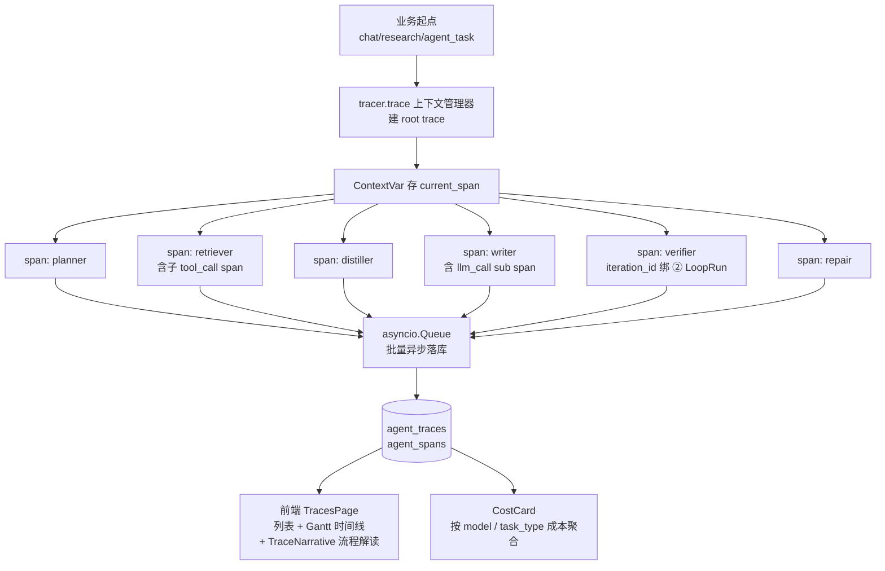

# Agent 全链路可观测(Tracing + 成本核算)— 设计与面试

> Verifier Loop 把「自我审视」做到了产物层(评分合格/不合格 → 回炉),但回答不了「**Agent 是怎么一步步做到的**」——中间调了哪些工具、每个 LLM 花了多少 token、补搜读了什么、为什么这一轮就通过了。Tracing 把「自我审视」下沉到执行链路层,遵循 OpenTelemetry GenAI 规范,做到自有最小可行版。
> 对应能力域:**工程化与部署**(可观测层)。代码:`core/agent/tracing/`(tracer/span_recorder/pricing/otel_attrs/models)。

---

## 0. 能力定位(对应招聘要求)

- 对应 JD:**「Agent 可观测性」「OpenTelemetry」「LLM 成本核算」「Trace/Span」「audit trail」**。
- 角色:V0.0.5 主线第三大需求——把「自我审视」从产物层下沉到执行链路层,**让 Agent 不只知道「自己做得对不对」,还知道「自己是怎么做到的」**,是 ② Verifier Loop 工作的天然延伸与放大器。

---

## 1. 解决什么问题

- **痛点 1**:② Verifier 把「自我审视」做到了产物层,但回答不了执行链路的问题——「这次研究跑了 40 秒中,planner 占多少、writer 占多少、verifier 占多少」「报告引用错了,具体是哪个 retriever 召回时漏了来源」「月底账单一堆钱,花在哪个 model / 哪类任务上」**全是黑盒**。
- **痛点 2**:业界标杆是 **LangSmith / Langfuse / Arize Phoenix / Helicone**,但要么收费要么外部依赖。**我们做自有最小可行版**——数据落自己的 PG,字段名遵守 OTel GenAI 规范,未来要导出到 OTel Collector / Jaeger / Tempo / LangSmith 改输出格式即可,零迁移成本。
- **方案**:基于 OpenTelemetry GenAI semantic convention 的 trace + span 双表模型,ContextVar 自动 parent 关联,asyncio.Queue 批量异步落库不阻塞主流程,每次 LLM 调用按 model 单价精确核算 CNY 成本,与 ② Verifier Loop 强关联实现完整 audit trail。

---

## 2. 架构 / 数据流



---

## 3. 核心设计与实现

### 3.1 数据模型(两张表)

```sql
agent_traces(
  id UUID PK,
  user_id, task_type ['research'|'chat'|'agent_task'|'eval'],
  task_id,                       -- 关联业务 ID(report_id / conversation_id / task_id)
  status ['running'|'done'|'failed'],
  total_tokens, total_cost_cny,
  started_at, ended_at,
  meta JSONB
)

agent_spans(
  id UUID PK,
  trace_id FK,
  parent_span_id FK NULL,        -- ContextVar 自动 parent 关联
  iteration_id NULL,             -- 关联 ② loop_iterations.id
  loop_run_id NULL,              -- 关联 ② loop_runs.id
  span_type ['planner'|'retriever'|'tool_call'|'llm_call'|'verifier'|'repair'|'writer'|...],
  name, model NULL,
  status, error_message,
  started_at, ended_at, duration_ms,
  input_tokens, output_tokens, cost_cny,
  attributes JSONB,              -- 完全兼容 OTel GenAI 属性
  request_summary,               -- 600 字 prompt 预览
  response_preview               -- 600 字回复预览
)
```

索引:`(user_id, started_at)` / `(trace_id)` / `(loop_run_id)` / `(span_type, status)`。

Alembic 迁移 `6727223d45f9`,`models/__init__.py` 注册 AgentTrace + AgentSpan。

### 3.2 OTel GenAI 规范对齐(字段不自造)

`otel_attrs.py` 定义标准属性常量:

```python
class GenAI:
    SYSTEM = "gen_ai.system"                    # openai / anthropic / zhipu
    REQUEST_MODEL = "gen_ai.request.model"      # glm-4-plus / deepseek-v3
    OPERATION_NAME = "gen_ai.operation.name"    # chat / embedding / rerank
    USAGE_INPUT_TOKENS = "gen_ai.usage.input_tokens"
    USAGE_OUTPUT_TOKENS = "gen_ai.usage.output_tokens"
    USAGE_TOTAL_TOKENS = "gen_ai.usage.total_tokens"
```

span 属性 JSONB 落库,字段名直接兼容 OTel GenAI 规范,**未来导出到 OTel Collector / Jaeger / Tempo / LangSmith 改输出格式即可**,零迁移成本。

### 3.3 Tracer 上下文管理器(ContextVar 自动 parent)

```python
async with tracer.trace(task_type="research", task_id=report_id) as trace_ctx:
    async with tracer.span("planner", span_type="llm_call", model="..."):
        result = await planner.ainvoke(...)
        push_llm_usage(result, model)         # 把 usage 推到当前外层 span
```

- `current_span` ContextVar 存当前栈顶 span,新 span 自动 parent 指向栈顶
- 异步任务里跨 await 边界自动继承(ContextVar 的特性)
- `span.__aexit__` 自动写结束时间 + 异常状态 + 推进 Queue

### 3.4 全链路埋点(7 处接入)

| 接入点 | 文件 | 埋点内容 |
|--------|-----|---------|
| `LLMClient.chat/embed/vision/rerank` | `core/llm/client.py` | 自带 `llm_call` span,`_extract_usage` 抽 token + `request_summary/response_preview` 600 字预览 |
| 深度研究 7 阶段 | `core/agent/research/engine.py` | planner/retriever(子 tool_call)/distiller/reflector/curator/writer per section/summarize 全包 span + `loop_run_id` 关联 ② |
| 对话编排双路径 | `core/agent/orchestrator.py` | function calling + ReAct 都包 `llm_span` 抽 `gathered.usage_metadata`,`tool.ainvoke` 包 `tool_call` span(含 `query/output_preview`) |
| Loop Controller | `core/agent/loop/controller.py` | verifier + repair 包 span,**`IterationOutcome.id` 预生成 UUID 与 store.record_iteration 共用,实现 iteration_id 精确关联** |
| 对话主路径 | `chat_service._run_chat_turn_bg` | 包 `tracer.trace(task_type="chat")`,bus emit `trace` 事件,trace_id 写进 `message.meta_data` |
| LangChain 流式 usage | `chat_model.py` | `ChatOpenAI(stream_usage=True)` —— 让流式响应也带 usage_metadata |
| Research 子模块 | `planner/distiller/reflector/curator/writer.py` | 调 `model.ainvoke/astream` 后用 `push_llm_usage(resp, model)` 把 usage 推到当前外层 span(**避免每个嵌套 span 都重新计费**) |

### 3.5 成本核算(`pricing.py`)

维护 model 单价表(prompt / completion 分别计价,单位元/百万 token):

```python
PRICING: dict[str, tuple[float, float]] = {
    "glm-4-plus": (50.0, 50.0),       # 智谱
    "glm-4-flash": (0.0, 0.0),
    "deepseek-v3-pro": (4.0, 16.0),   # DeepSeek
    "gpt-4o": (35.0, 105.0),          # OpenAI(按汇率折 CNY)
    "qwen-plus": (4.0, 12.0),         # 通义
    # ...20+ 常用 OpenAI 兼容模型
}

def compute_cost_cny(model, input_tokens, output_tokens) -> float:
    prompt_rate, completion_rate = PRICING.get(model, (0.0, 0.0))
    return (input_tokens * prompt_rate + output_tokens * completion_rate) / 1_000_000
```

每次 llm_call span 自动算 `cost_cny`,trace 级聚合 `total_cost_cny` + `total_tokens`。

**取舍**:单价手动维护,**不做实时拉外部 API 同步**(各家定价波动小、且 LLM 厂商没统一 API)。配置项 `COMET_PRICING_OVERRIDES` 允许 .env 覆盖。

### 3.6 异步批量落库(`span_recorder.py`)

- asyncio.Queue 接收 span 完成事件
- 后台 worker 协程批量(默认 50 条 / 1s)写库
- 业务主流程**不阻塞**(span 关闭只 enqueue,不等 DB)
- 队列满兜底:丢最早的 span 并打 warning(可用性优先)

---

## 4. 接口与前端

### 4.1 后端接口

| 端点 | 用途 |
|------|------|
| `GET /traces?task_type=&task_id=&status=&days=` | 列表筛选 |
| `GET /traces/cost-summary?days=7` | 按 model + task_type 聚合成本 |
| `GET /traces/{trace_id}` | 详情含 span 树 |

**静态路由顺序**:`/cost-summary` 必须注册在 `/{trace_id}` 之前,避免 UUID 路由吞掉 cost-summary。

### 4.2 前端 TracesPage 与时间线

- `pages/TracesPage.tsx` —— KPI 卡 + Segmented 筛选 + 紧凑表格行(grid 列对齐 + 状态点圆形指示)
- `components/trace/TraceTimeline.tsx` —— Gantt 时间线,每 span 一条横条按耗时缩放,颜色按 type,内联手风琴展开(**不用两层 Drawer**)
- `components/trace/TraceNarrative.tsx` —— 流程解读,按 span 嵌套层级拆解 Agent 决策过程,**用户视角中文化**
- 字段中文化但保留专业英文(LLM / MCP / tokens 不翻译);移除 `span_id` 等技术 id
- 手机端 Drawer 改 `placement="bottom"`
- 长文本预览(`request_summary` / `response_preview` / `output_preview` / `tool_query`)单独大块展示

### 4.3 反向入口(从业务页跳轨迹)

| 来源 | 入口 |
|------|------|
| 研究报告页 | `ResearchPage` 报告区「执行轨迹」按钮 → `/traces?task_id=report_id` 自动展开 |
| 定时任务运行历史 | `AgentTaskPage` 每条 run 行「轨迹」入口 |
| 对话气泡 | 每条 AI 消息底部「执行轨迹」按钮(`MessageItem.tsx` + `Message.meta_data.trace_id` 持久化) |

### 4.4 仪表盘成本卡

`CostCard.tsx`:
- 4 宫 KPI:总 trace 数 / 总 tokens / 总成本 CNY / 平均每次任务成本
- 按 model 成本饼图(echarts emphasis label)
- 按 task_type 横向柱图
- Segmented 切 7 / 30 / 90 天

HomePage 在 Agent 简报后渲染,无数据时不显示。

---

## 5. 与 ② Verifier Loop 的关联点(打开黑盒)

```
深度研究 trace
├── planner span
├── retriever span (3 子 tool_call: 联网/KB/MCP)
├── distiller span (×N 源)
├── writer span (×N 章节)
└── verifier_loop span
    ├── iteration 1 (loop_iterations.id = X)
    │   ├── verifier_call span (llm_call, model=glm-4-plus)
    │   │   └── 评分 0.6 不通过
    │   ├── policy_decide span (action=PatchRepair)
    │   └── patch_repair span
    │       ├── reflector span
    │       └── retriever span (子 tool_call)
    └── iteration 2
        ├── verifier_call span → 0.78 通过
        └── policy_decide span (action=Pass)
```

这套关联**直接让简历讲点翻倍**:不再是「我做了 verifier」,而是「**Verifier 每轮回炉的执行路径全可下钻 audit、token 成本精确到元、能定位是哪个 repair 决策让报告变好**」。

---

## 6. 设计取舍

| 取舍 | 选择 | 原因 |
|------|-----|------|
| 接入 Jaeger / Tempo / LangSmith? | 不接 | 自有 PG 表够用,字段名兼容 OTel GenAI 规范,未来要切换零成本。商业版工程量大但本项目流量小,负收益。 |
| 实时同步外部 API 单价? | 不做 | 各家定价波动小、且没统一 API。手动维护 + `COMET_PRICING_OVERRIDES` 覆盖 |
| Replay(基于历史 trace 改 prompt 重跑) | 不做 | LangSmith 高级功能,工程量大,本版无强需求,留 backlog |
| 流式 token 都建 span? | 不建 | token 级粒度浪费,只在 LLM 调用结束时记一个 llm_call span |
| 全采还是采样? | 默认全采 | 本项目流量小;可配置 `TRACE_SAMPLE_RATE`(0~1)在高流量下降采样 |
| 对普通用户暴露? | 否 | 默认仅项目主理可见,后期可加 admin 角色判断 |

---

## 7. 易踩坑

- **静态路由被 UUID 吞**:`GET /traces/cost-summary` 如果注册在 `GET /traces/{trace_id}` 之后,FastAPI 会把 `cost-summary` 当成 trace_id 参数。**静态路径必须先注册**。
- **流式 LLM 没 usage**:LangChain `ChatOpenAI` 流式默认不带 `usage_metadata`,必须传 `stream_usage=True`。这是非常容易遗漏的开关。
- **嵌套 span 重复计费**:planner/distiller 内部又调 LLMClient 会产生嵌套 llm_call span,如果每一层都算 cost 就重复了。修法:**用 `push_llm_usage(resp, model)` 把 usage 推到当前外层业务 span**,llm_call span 自身记录但 trace 级汇总只算外层。
- **iteration_id 关联**:② Verifier 的 `IterationOutcome.id` 必须**预生成 UUID 与 LoopStore.record_iteration 共用**,这样 span.iteration_id 才能精确绑定到对应迭代轮次。设计时就要确定,后改困难。
- **span 关闭异常会丢失**:async with 退出时 enqueue,如果 enqueue 抛异常会污染主流程。修法:span 关闭逻辑全包 try/except,失败只 warning 不外抛。
- **Queue 满**:asyncio.Queue 满时丢最早的 span 而不是阻塞主流程——可用性优先。

---

## 8. 面试讲点(每条对应真决策 + 真数据)

1. **遵循 OTel GenAI 规范**:不自造土字段,业界标准,未来导出零成本。
2. **解耦观测与业务**:tracer.span 上下文管理器 + ContextVar 自动 parent,业务代码只需 `async with` 包一层,主流程零侵入。
3. **打开 ② Verifier 黑盒**:不仅看「评分多少」,还看「每轮 verify 调了什么、为什么这一轮通过」——audit trail 完整可下钻。
4. **精确到元的成本核算**:每次 LLM 调用算 cost_cny,trace 级汇总,知道月底账单花在哪个 model 哪类任务上。
5. **异步批量落库不阻塞**:asyncio.Queue + 后台 worker 批量,业务主流程零延迟。
6. **明确边界**:不接外部 trace 后端、不做 Replay,知道哪些不该做。

---

## 9. 简历话术(可直接用)

> **Agent 全链路可观测系统**:遵循 OpenTelemetry GenAI semantic convention 的 trace/span 模型埋点,覆盖深度研究 / 对话 / 定时任务 / Verifier Loop 全链路;ContextVar 自动 parent 关联 + asyncio.Queue 异步批量落库不阻塞主流程;每个 LLM 调用 span 记录 model + tokens 并按单价精确核算 CNY 成本;与 ② Verifier Loop 强关联,前端 Gantt 时间线支持下钻每轮回炉的执行路径、prompt/response、评分理由,实现 Agent 决策完整 audit trail。

---

## 10. 相关文件速查

| 类别 | 路径 |
|------|------|
| Tracer | `api/app/core/agent/tracing/tracer.py` |
| Span Recorder | `api/app/core/agent/tracing/span_recorder.py` |
| Pricing | `api/app/core/agent/tracing/pricing.py` |
| OTel Attrs | `api/app/core/agent/tracing/otel_attrs.py` |
| 模型 | `api/app/core/agent/tracing/models.py` + `models/agent_trace_model.py` |
| 迁移 | `api/migrations/versions/6727223d45f9_*.py` |
| Controller | `api/app/controllers/trace_controller.py` |
| Service | `api/app/services/trace_service.py` |
| 埋点 - LLMClient | `api/app/core/llm/client.py` |
| 埋点 - Research | `api/app/core/agent/research/engine.py` + `{planner,distiller,reflector,curator,writer}.py` |
| 埋点 - Orchestrator | `api/app/core/agent/orchestrator.py` |
| 埋点 - Loop | `api/app/core/agent/loop/controller.py` |
| 前端列表 | `web/src/pages/TracesPage.tsx` |
| 前端时间线 | `web/src/components/trace/TraceTimeline.tsx` + `TraceNarrative.tsx` |
| 仪表盘成本卡 | `web/src/components/dashboard/CostCard.tsx` |
